# Cloud DevOps Nanodegree Capstone
An automated CI/CD pipeline with a blue/green deployment system.

## Technologies
- Jenkins for building artifacts and Docker images.

- Amazon Web Services (AWS) Elastic Kubernetes Service (EKS).
- AWS CloudFormation for Infrastructure as Code.
- [eksctl](https://eksctl.io) for simple management of EKS resources.

## Initialization
The full project is based on pushing automation to the extreme. Once I got started, I just kept going. Initialization is done by running the [`initialize.sh`](./initialize.sh) script to
1. Create an EC2 that hosts Jenkins inside a Docker container
    - Using the Jenkins Infrastructure as Code (IaC) plugin, everything necessary to start building pipelines is set up. All that is required is to login.
    - Additionally, I built a Docker image that automates Jenkins setup so the only thing required is to create the [`JenkinsBox`](./cloudformation/JenkinsBox/stack.yaml) stack using the `aws-cli`. More information about this Jenkins build is available in the `jenkins` folder.
1. Create an EKS cluster and node group to host the Cyan App Docker container on a Kubernetes cluster.
    - This in particular can take 15-20 minutes!
    - `eksctl` automatically creates a full Cloud Formation stack with everything EKS will need to function including...
        - A VPC
        - Private and public subnets
        - Appropriate security groups and roles
        - A `Control Plane` for Kubernetes
        - An auto-scaling EC2 node group.
1. Create a DNS record that points to the Load Balancer created by Kubernetes.
    - This is accomplished with the [`dns.py`](./cloudformation/DNS/dns.py) script and the Cloud Formation template [`dnsrecordset.yaml`](./cloudformation/DNS/dnsrecordset.yaml)


Here is the output from running this command:
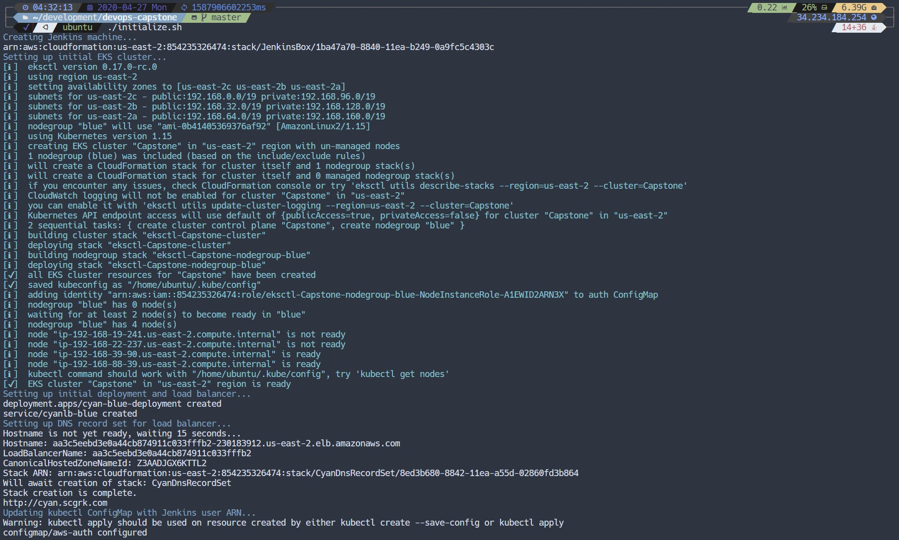
Once this is finished, everything is ready to go! Logging into Jenkins will allow setup of a pipeline for automated CI/CD.

The initial application is ready to be used and can be accessed from the endpoint provided by Kubernetes
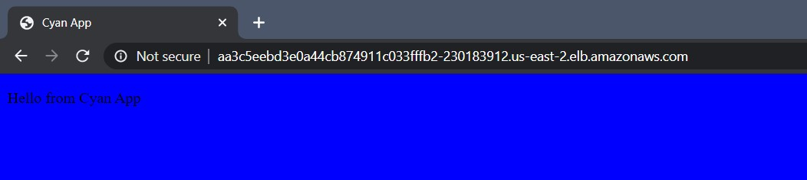
Or by using the DNS record created during initialization.
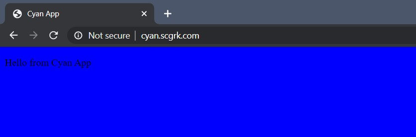

## Logging in to Jenkins
The `JenkinsBox` stack creates a DNS record for easy access to the GUI or for ssh without needing to remember an IP address or AWS DNS.


No configuration required, we're ready to create a Pipeline. The Blue Ocean plugin is a lot easier to understand and work with than the default Jenkins management console. Simply follow the prompts, and a pipeline is created!
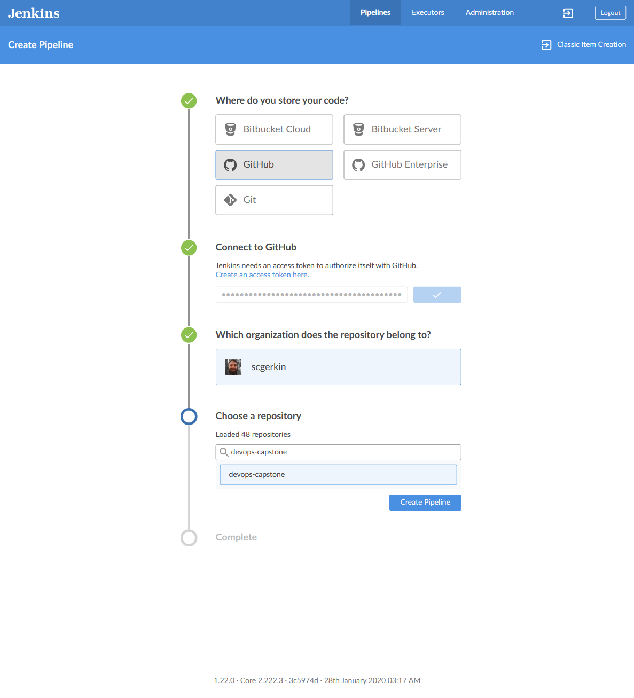

## Demonstration Application - "Cyan App"
### When you combine blue with green, the resultant color is cyan. Hence, Cyan App!
This is the application being built and deployed by the CI/CD pipeline. It is a
simple Java Spring Boot application that serves up a static
[`index.hmtl`](./src/main/resources/templates/index.html) using ThymeLeaf templates. The application originally has a blue background to indicate that it
is the original application during deployment in the blue/green deployment scheme.

The project uses Maven as a  base build tool. Maven already possesses a rather robust lifecycle for automated testing, building, and deploying. However, for
the purposes of this project, each necessary Maven `goal` is run individually
in Jenkins for demonstration and incremental testing while constructing the
full pipeline.

### Build Process
The build process with Maven is meant only as a demonstration. Ideally, we would want to use the
[Maven Release Plugin](http://maven.apache.org/maven-release/maven-release-plugin/) to manage our
deployments and automate versioning the application. As this project is meant as a demonstration for
Jenkins and automatic deployments with EKS, the build process for the `.jar` artifact is very rudimentary
and broken down into a few extra pieces to highlight the actions taken by Jenkins.

The process includes:
- Cleaning the `target` directory of compiled sources for a fresh build
    - Artifacts should not be present already, but this adds an extra level of redundancy at little cost.
- Linting Java files according to the [Google Java Style Guide](https://google.github.io/styleguide/javaguide.html).
    - Any failure in linting will cause an early failure of the pipeline, but it would be better to automate linting and fixing small problems where possible.
- Running unit tests written in jUnit with the Maven test runner.
    - Maven compiles sources before running tests automatically, so this is not included.
    - At this point, we would also want to consider outputting the results into a file (particularly for failure).
- Packaging artifacts as a `.jar` file.
- Running automated tools on compiled `.class` files.
    - [SpotBugs](https://spotbugs.github.io/) for automatic detection of known bug patterns.
    - [PMD Source Code Analyzer](https://pmd.github.io/) for automatic detection of 'code smells'.
- A post-build process to clean the `target` directory and free resources (regardless of build result).

## Pipeline Actions
The pipeline consists of the above build process, as well as some additional steps to
- Build a Docker image of the application
- Deploy the image to the [Docker Hub repository](https://hub.docker.com/repository/docker/scgerkin/cyan-app)
- Create EKS resources for deploying the new images. This is broken into two branches

### Feature Testing
The Feature Testing branch allows a completely new EKS cluster to be created where the application can be deployed. From there, alerts are sent with AWS Simple Notification System to a Topic that can then be dispersed to subscribers. I've set it up to email me when certain actions happen. Ideally, this branch can be expanded upon to include integration testing, load tests, QA testing, or anything else that requires the application to be deployed and in a real environment but not yet released to end users. For simplicity sake, this pipeline hosts the application to see if the page is visible before asking for input to continue.

### Master Testing and Deployment
The Master branch can receive incoming pull requests and update the application to deploy to end users. EKS and Kubernetes provide automatic load balancing with the declarative style of cluster management. At any point, we can simply tell Kubernetes what we want everything to look like and it'll figure out the details. This is very customizable, but as with the Feature Testing branch, this pipeline is very simple and asks for input at various stages while switching load balancing and creating/destroying resources dynamically.

# Pipeline Demonstration
What follows is a series of screenshots throughout the build process. It starts by creating the initial pipeline with linting errors in the Java source code. This is fixed, pushed again, and a successful build occurs. Then, a new Feature is created (changing the background to green) and the process is followed until deployment on the Master branch.

Jenkins starts by indexing the source code and building the pipeline.
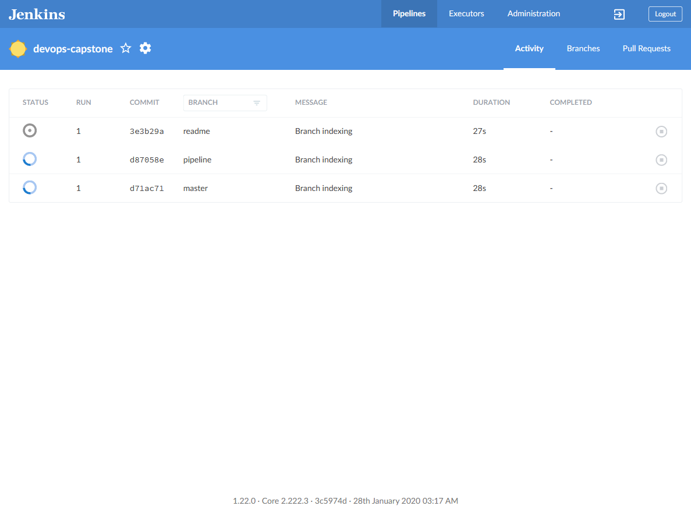

The initial `master` branch build fails because the linter detects a violation.
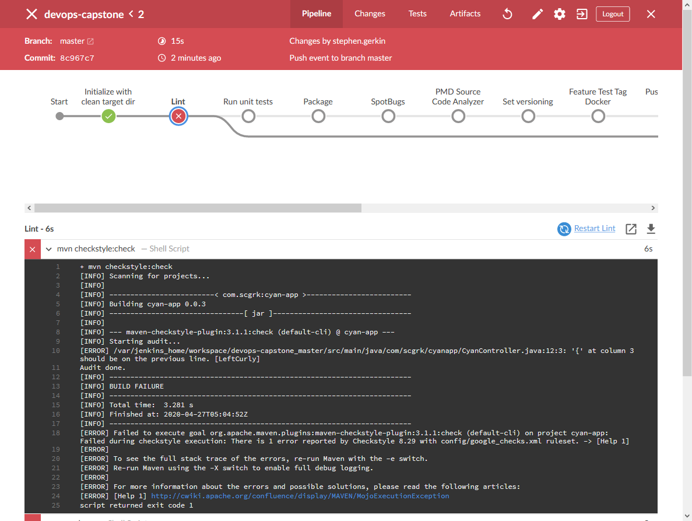

Bad curly brace placement!
```java
  @GetMapping("/")
  public ModelAndView getIndex()
  {
    return new ModelAndView("index");
  }
```

Next, I go back into the application and fix the style problems, run the Maven goal locally, and push the fixed code to the github repository.

Good curly brace placement!
```java
  @GetMapping("/")
  public ModelAndView getIndex() {
    return new ModelAndView("index");
  }
```
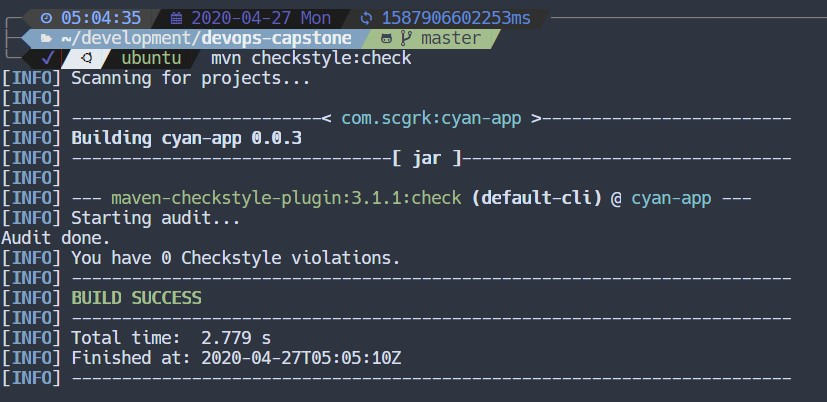

With the syntax fixed, the linter stops complaining and we can move on. Jenkins performs the rest of the application build steps, finds the Maven build version, and uses it to create and push a new Docker image. It moves over the stages that require to be on the `master` branch before creating resources to deploy the new image to a new node group.
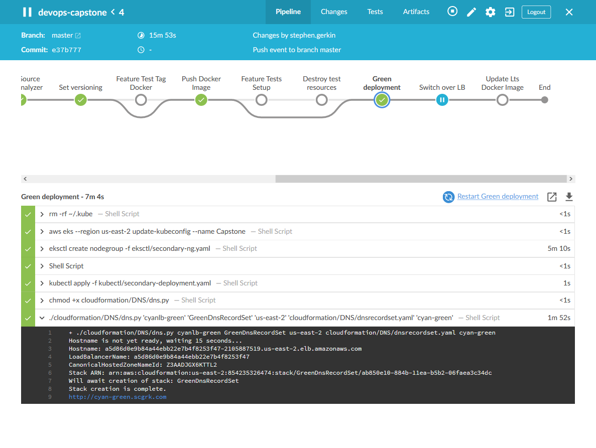

A DNS record is created so we can easily navigate to the app and see that it is, indeed, deployed!
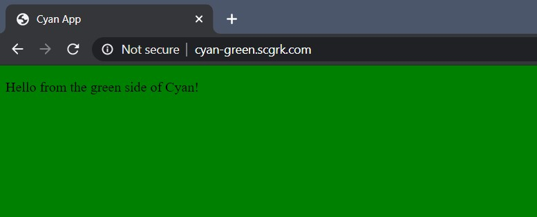

Input is requested at this point before switching the Kubernetes load balancer. After switching over the load balancer, another input is requested before destroying the created resources in case we need to revert.
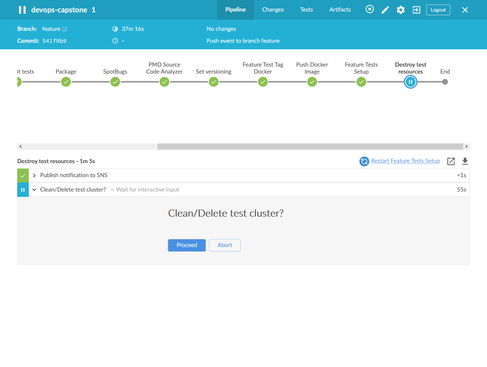

The build completes successfully and we're requested again to verify that we want to release the latest version of the app on Docker with the `lts` tag.
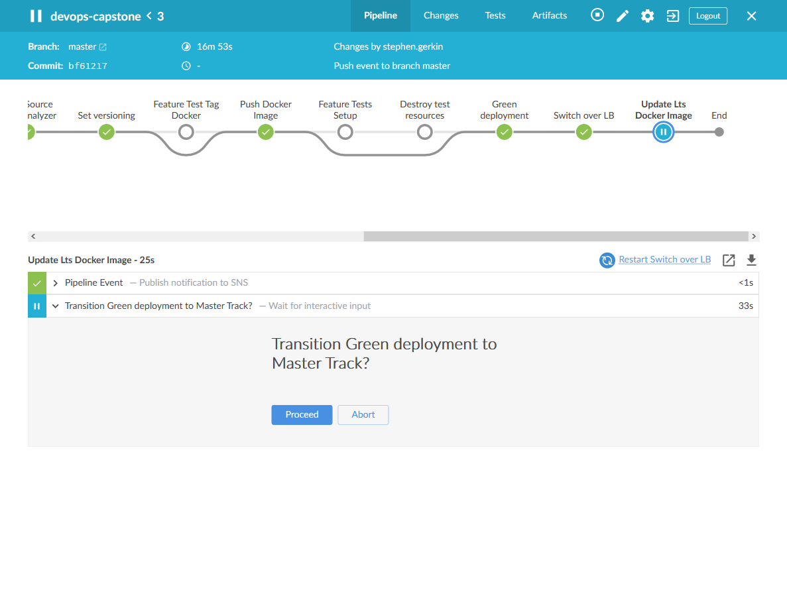

A fully completed build is done! Kubernetes is now told to pull the latest Docker image and use it for our containers.
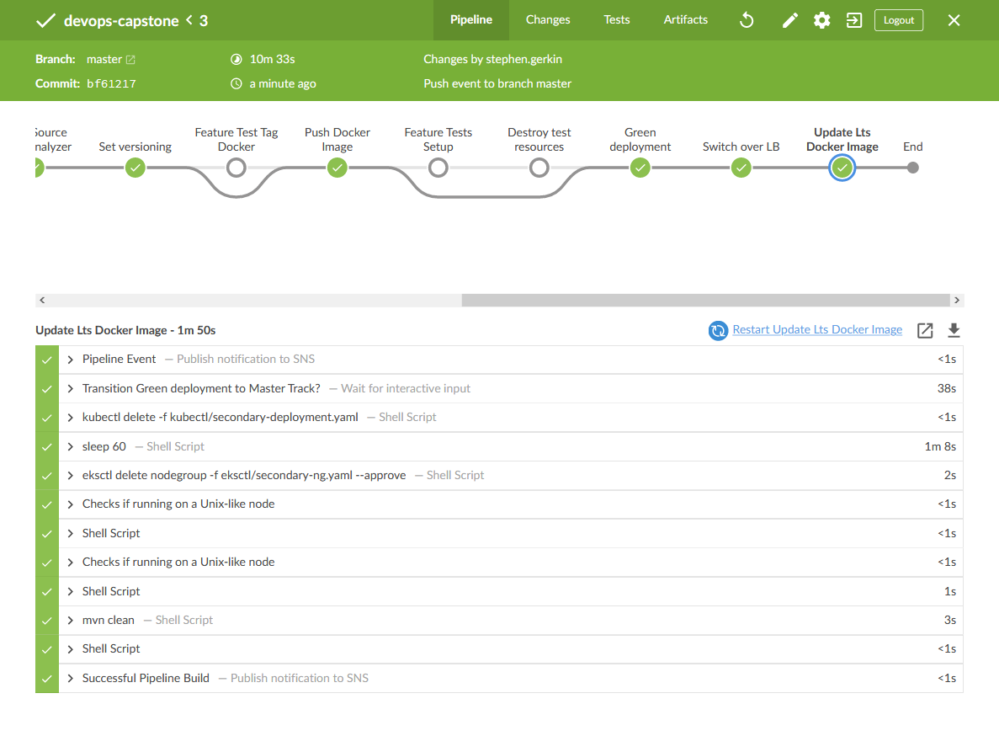

## Last thoughts
I've left out some of the screenshots and overall build process from above. While doing the build, I forgot to take some screenshots at some points and had to patch things together from when I remembered during various phases, but I think you get the overall picture. The code tells the real story!

This project was extremely challenging, engaging, and very rewarding! One month ago, I barely knew what CI/CD was and now I have a much better understanding of the benefits of using it, but also what goes into creating it. I plan to add more information to this later, so check back in a week or so!
