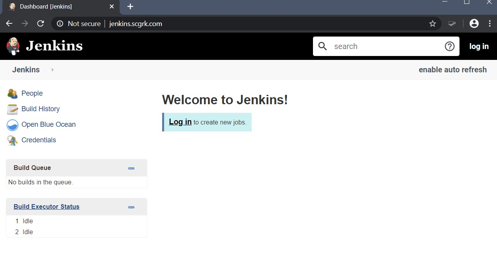

# Cloud DevOps Nanodegree Capstone
An automated CI/CD pipeline with a blue/green deployment system.

## Technologies
- Jenkins for building artifacts and Docker images.

- Amazon Web Services (AWS) Elastic Kubernetes Service (EKS).
- AWS CloudFormation for Infrastructure as Code.
- [eksctl](https://eksctl.io) for simple management of EKS resources.

## Initialization
The full project is based on pushing automation to the extreme. Once I got started, I just kept going. Initialization is done by running the [`initialize.sh`](./initialize.sh) script to
1. Create an EC2 that hosts Jenkins inside a Docker container
    - Using the Jenkins Infrastructure as Code (IaC) plugin, everything necessary to start building pipelines is set up. All that is required is to login.
    - Additionally, I built a Docker image that automates Jenkins setup so the only thing required is to create the [`JenkinsBox`](./cloudformation/JenkinsBox/stack.yaml) stack using the `aws-cli`. More information about this Jenkins build is available in the `jenkins` folder.
1. Create an EKS cluster and node group to host the Cyan App Docker container on a Kubernetes cluster.
    - This in particular can take 15-20 minutes!
    - `eksctl` automatically creates a full Cloud Formation stack with everything EKS will need to function including...
        - A VPC
        - Private and public subnets
        - Appropriate security groups and roles
        - A `Control Plane` for Kubernetes
        - An auto-scaling EC2 node group.
1. Create a DNS record that points to the Load Balancer created by Kubernetes.
    - This is accomplished with the [`dns.py`](./cloudformation/DNS/dns.py) script and the Cloud Formation template [`dnsrecordset.yaml`](./cloudformation/DNS/dnsrecordset.yaml)

Here is the output from running this command:

Once this is finished, everything is ready to go! Logging into Jenkins will allow setup of a pipeline for automated CI/CD.

The initial application is ready to be used and can be accessed from the endpoint provided by Kubernetes

Or by using the DNS record created during initialization.

## Logging in to Jenkins
The `JenkinsBox` stack creates a DNS record for easy access to the GUI or for ssh without needing to remember an IP address or AWS DNS.

## Demonstration Application - "Cyan App"
### When you combine blue with green, the resultant color is cyan. Hence, Cyan App!
This is the application being built and deployed by the CI/CD pipeline. It is a
simple Java Spring Boot application that serves up a static
[`index.hmtl`](./src/main/resources/templates/index.html) using ThymeLeaf templating. The application originally has a blue background to indicate that it
is the original application during deployment in the blue/green deployment scheme.

The project uses Maven as a  base build tool. Maven already possesses a rather robust lifecycle for automated testing, building, and deploying. However, for
the purposes of this project, each necessary Maven `goal` is run individually
in Jenkins for demonstration and incremental testing while constructing the
full pipeline.

### Build Process
The build process with Maven is meant only as a demonstration. Ideally, we would want to use the
[Maven Release Plugin](http://maven.apache.org/maven-release/maven-release-plugin/) to manage our
deployments and automate versioning the application. As this project is meant as a demonstration for
Jenkins and automatic deployments with EKS, the build process for the `.jar` artifact is very rudimentary
and broken down into a few extra pieces to highlight the actions taken by Jenkins.

The process includes:
- Cleaning the `target` directory of compiled sources for a fresh build
    - Artifacts should not be present already, but this adds an extra level of redundancy at little cost.
- Linting Java files according to the [Google Java Style Guide](https://google.github.io/styleguide/javaguide.html).
    - Any failure in linting will cause an early failure of the pipeline, but it would be better to automate linting and fixing small problems where possible.
- Running unit tests written in jUnit with the Maven test runner.
    - Maven compiles sources before running tests automatically, so this is not included.
    - At this point, we would also want to consider outputting the results into a file (particularly for failure).
- Packaging artifacts as a `.jar` file.
- Running automated tools on compiled `.class` files.
    - [SpotBugs](https://spotbugs.github.io/) for automatic detection of known bug patterns.
    - [PMD Source Code Analyzer](https://pmd.github.io/) for automatic detection of 'code smells'.
- A post-build process to clean the `target` directory and free resources (regardless of build result).
